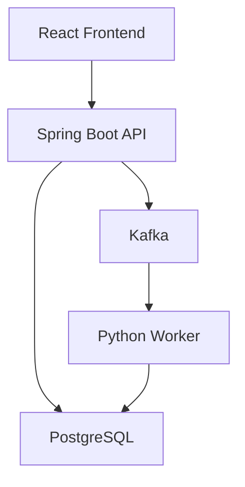
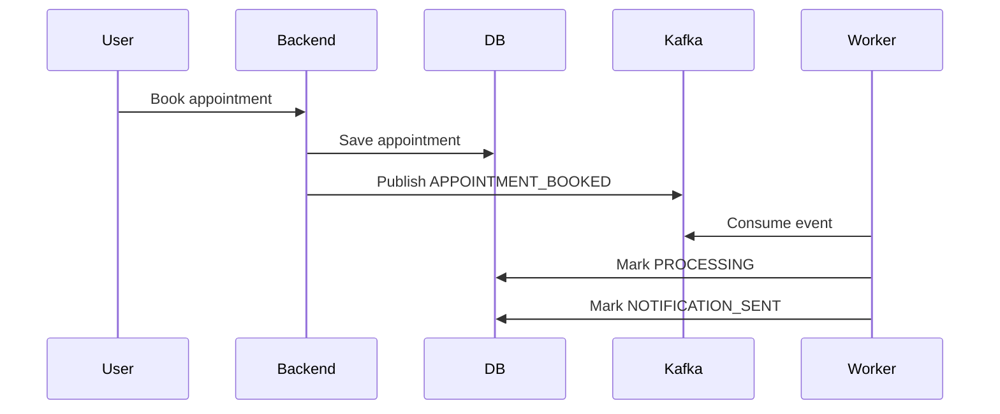

# Architecture

## High-Level Design



## Backend Responsibilities

The Spring Boot backend handles:

- authentication
- authorization
- appointment APIs
- database transactions
- duplicate booking prevention
- Kafka event publishing
- Swagger API documentation

## Worker Responsibilities

The Python worker handles:

- consuming Kafka appointment events
- simulating notification delivery
- updating appointment processing status
- inserting appointment logs

## Event-Driven Flow



## Why Kafka?

Kafka decouples appointment booking from notification processing.

The booking API can complete after saving the appointment and publishing the event. Notification work happens asynchronously in the Python worker.

## Why Flyway?

Flyway keeps schema changes versioned and repeatable.

Instead of relying on Hibernate to create tables automatically, the application uses SQL migrations. This is closer to production backend practice.

## Why JWT?

JWT allows the backend to stay stateless.

Each protected request carries:

```http
Authorization: Bearer <token>
```

The backend validates the token and identifies the user without storing server-side sessions.

## Why Database-Level Duplicate Booking Prevention?

Application-level checks are not enough under concurrency.

Two users may hit the same slot at the same time. The database unique partial index guarantees correctness:

```sql
CREATE UNIQUE INDEX uk_active_slot_booking
ON appointments(slot_id)
WHERE status = 'BOOKED';
```